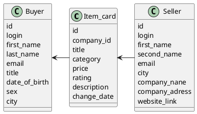

# Компонентная архитектура
<!-- Состав и взаимосвязи компонентов системы между собой и внешними системами с указанием протоколов, ключевые технологии, используемые для реализации компонентов.
Диаграмма контейнеров C4 и текстовое описание. 
-->
## Компонентная диаграмма

```plantuml
@startuml
!include https://raw.githubusercontent.com/plantuml-stdlib/C4-PlantUML/master/C4_Container.puml

AddElementTag("microService", $shape=EightSidedShape(), $bgColor="CornflowerBlue", $fontColor="white", $legendText="microservice")
AddElementTag("storage", $shape=RoundedBoxShape(), $bgColor="lightSkyBlue", $fontColor="white")

Person(admin, "Администратор", "Владелец маркетплейса")
Person(seller, "Продавец товара", "Реализует собственную продукцию на платформе")
Person(buyer, "Покупатель", "Покупает желаемый товар у любого из продавцов")

System_Ext(web_site, "Клиентский веб-сайт", "HTML, CSS, JavaScript, React", "Веб-интерфейс")

Rel(seller, web_site, "Создание страницы магазина, добавление карточки товара, изменение информации о товаре, удаление товара")
Rel(buyer, web_site, "Просмотр карточек товаров, поиск товаров по маске названия, добавление товара в корзину, оформление доставки товара")
Rel(admin, web_site, "Модерация товаров, рекомендательная система товаров для покупателей, предоставление аналитики продавцам, поиск продавца и покупателя по маске")


System_Boundary(conference_site, "Маркетплейс") {
   'Container(web_site, "Клиентский веб-сайт", ")
   Container(authorize_service, "Сервис авторизации", "C++", "Сервис управления пользователями", $tags = "microService")    
   Container(item_service, "Сервис управления карточкой товара", "C++", "Сервис создания/редактирования/удаления карточки товара", $tags = "microService") 
   Container(recsys_service, "Рекомендательная система", "C++", "Сервис рекомендательной системы товаров покупателя", $tags = "microService + ML")
   Container(get_item, "Просмотр карточек товаров", "C++", "Сервис для просмотра товаров и их поиску", $tags="microService")
   ContainerDb(db, "База данных", "PostgreSQL", "Хранение данных о блогах, постах и пользователях", $tags = "storage")
}


Rel(web_site, get_item, "Работа с покупателем", "localhost/get_item")
Rel(get_item, db, "INSERT/SELECT/UPDATE", "SQL")

Rel(web_site, item_service, "Работа с карточкой товара продавцом", "localhost/construct_item")
Rel(item_service, db, "INSERT/SELECT/UPDATE", "SQL")

Rel(web_site, recsys_service, "Работа рекомендательной системы", "localhost/recommend")
Rel(recsys_service, db, "INSERT/SELECT/UPDATE", "SQL")

Rel(web_site, authorize_service, "Работа покупателями и  продавцами", "localhost/auth")
Rel(authorize_service, db, "INSERT/SELECT/UPDATE", "SQL")


@enduml
```
## Список компонентов  

### Сервис авторизации
**API**:
-	Создание нового пользователя
      - входные параметры: login, пароль, имя, фамилия, отчество, email, обращен (г-н/г-жа), дата рождения, пол, город проживания
      - выходные параметры: отсутствуют
-	Поиск пользователя по логину
     - входные параметры:  login
     - выходные параметры: имя, фамилия, email, обращение (г-н/г-жа)
-	Поиск пользователя по маске имени и фамилии
     - входные параметры: маска фамилии, маска имени
     - выходные параметры: login, имя, фамилия, email, обращение (г-н/г-жа)

### Сервис управления карточкой товара
**API**:
- Создание карточки товара
  - Входные параметры: название товара, категория, цена, производитель, описание, картинка товара, рейтинг, id продавца товара
  - Выходыне параметры: id товара
- Изменение карточки товара:
  - Входные параметры: id карточки товара, словарь актуальных параметров в виде json 
  - Выходные параметры: отсутствуют
- Удаление товара6
  - Входные параметры: id карточки товара
  - Выходные параметры: отсутствуют

### Сервис просмотра карточек товаров
**API**
- Поиск товара
  - Входные параметры: атрибуты карточки товара
  - Выходные параметры: массив id искомого товара и товаров из искомой категории (искомый товар на первом месте массива)
- Просмотр категорий товаров:
  - Входные данные: категория товара
  - Выходные данные: массив карточек релевантных товаров 
- Получение списка товаров для стартовой страницы:
  - Входные данные: рекомендательная система
  - Выходные данные: массив карточек релевантных товаров 

### Сервис рекомендательная система
**API**:
- Рекомендация для клиента
  - Входные параметры: входные параметры клиента и его активности 
  - Выходные параметры: массив id 5 наиболее релевантных карточек к покупке


### Модель данных
